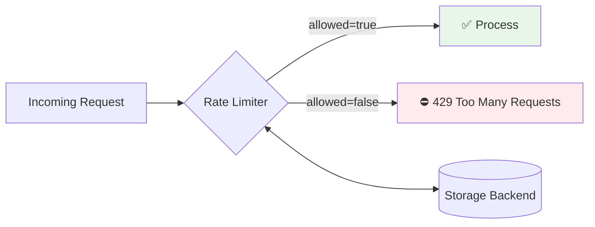
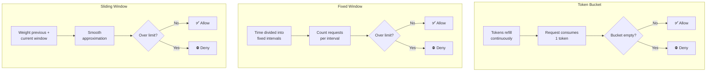

# ratelimit-ts

A lightweight, zero-dependency rate limiter for TypeScript/Node.js with support for multiple algorithms and pluggable storage backends.

## Features



- **Three algorithms**: Token Bucket, Fixed Window, Sliding Window Counter
- **Zero runtime dependencies**: Only dev dependencies for testing
- **Pluggable storage**: Built-in memory store, easy to implement Redis/etc
- **TypeScript-first**: Full type definitions included
- **Async/await**: All operations are async for storage backend compatibility

## Installation

```bash
npm install ratelimit-ts
```

## Quick Start

```typescript
import { TokenBucket, FixedWindow, SlidingWindow } from 'ratelimit-ts';

// Token Bucket: 100 requests per minute with burst support
const limiter = new TokenBucket({ limit: 100, window: 60_000 });

const result = await limiter.consume('user:123');
if (!result.allowed) {
  console.log(`Rate limited. Retry in ${result.retryAfter}ms`);
}
```

## Algorithms

### Token Bucket

Best for: APIs that need to allow short bursts while maintaining an average rate.

Tokens refill continuously. Each request consumes one token. If the bucket is empty, requests are denied until tokens refill.

```typescript
const limiter = new TokenBucket({
  limit: 10,     // 10 tokens max (burst capacity)
  window: 1000,  // refills completely in 1 second
});
```

### Fixed Window

Best for: Simple rate limiting where exact fairness at boundaries is not critical.

Divides time into fixed intervals and counts requests per interval. Simple and memory-efficient.

```typescript
const limiter = new FixedWindow({
  limit: 100,      // 100 requests
  window: 60_000,  // per minute
});
```

### Sliding Window Counter

Best for: More accurate rate limiting that avoids the boundary burst problem of fixed windows.

Combines the current and previous window counts with time-based weighting for a smooth approximation.

```typescript
const limiter = new SlidingWindow({
  limit: 100,
  window: 60_000,
});
```

## API

All limiters implement the `RateLimiter` interface:

```typescript
interface RateLimiter {
  consume(key: string): Promise<RateLimitResult>;
  peek(key: string): Promise<RateLimitResult>;
  reset(key: string): Promise<void>;
}

interface RateLimitResult {
  allowed: boolean;     // Was the request allowed?
  remaining: number;    // Remaining capacity
  limit: number;        // Total limit
  resetAt: number;      // Unix ms when limit resets
  retryAfter: number;   // Ms until retry would succeed (0 if allowed)
}
```

### `consume(key)`

Check the rate limit and consume one token/slot. Returns the result with updated state.

### `peek(key)`

Check the current state without consuming. Useful for displaying remaining capacity to users.

### `reset(key)`

Clear all state for a key, restoring full capacity.

## Custom Storage

Implement the `RateLimitStore` interface to use Redis, DynamoDB, or any other backend:

```typescript
import { RateLimitStore, StoredEntry, TokenBucket } from 'ratelimit-ts';

class RedisStore implements RateLimitStore {
  async get(key: string): Promise<StoredEntry | null> { /* ... */ }
  async set(key: string, entry: StoredEntry, ttlMs: number): Promise<void> { /* ... */ }
  async delete(key: string): Promise<void> { /* ... */ }
}

const limiter = new TokenBucket(
  { limit: 100, window: 60_000 },
  new RedisStore()
);
```

## Express Middleware Example

```typescript
import { TokenBucket } from 'ratelimit-ts';
import express from 'express';

const limiter = new TokenBucket({ limit: 100, window: 60_000 });

function rateLimit(req: express.Request, res: express.Response, next: express.NextFunction) {
  const key = req.ip || 'unknown';
  limiter.consume(key).then(result => {
    res.set('X-RateLimit-Limit', String(result.limit));
    res.set('X-RateLimit-Remaining', String(result.remaining));
    res.set('X-RateLimit-Reset', String(result.resetAt));

    if (!result.allowed) {
      res.set('Retry-After', String(Math.ceil(result.retryAfter / 1000)));
      return res.status(429).json({ error: 'Too many requests' });
    }
    next();
  });
}

const app = express();
app.use(rateLimit);
```

## Algorithm Comparison



| Algorithm | Burst Handling | Accuracy | Memory | Best For |
|-----------|---------------|----------|--------|----------|
| Token Bucket | Allows bursts up to limit | Good | Low | APIs, burst-friendly |
| Fixed Window | 2x burst at boundaries | Moderate | Very low | Simple counters |
| Sliding Window | Smooth, no boundary burst | High | Low | Strict rate limits |

## License

MIT
